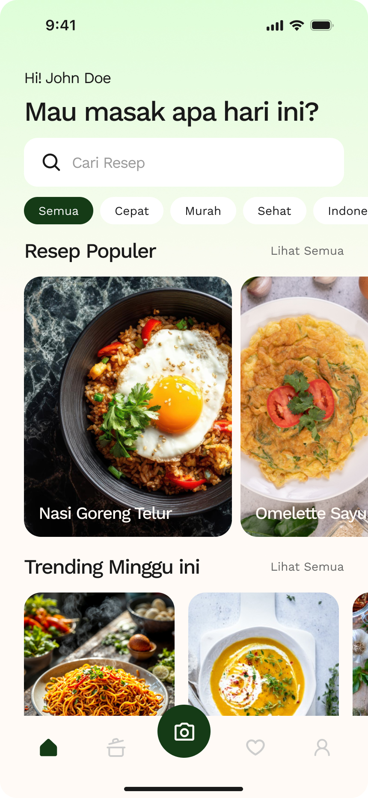

# CookSnap

**Aplikasi Mobile Berbasis AI untuk Mendeteksi Bahan Makanan & Rekomendasi Resep**

*“Masak dari apa yang kamu punya sekarang.”*

[](https://flutter.dev/)
[](https://pocketbase.io/)
[](https://ai.google.dev/)

### 📥 [Download APK CookSnap v1.0.0](https://github.com/rianmubarok/cooksnap-mobile-app/releases/download/v1.0.0/cooksnap-v1.0.0.apk)

---

## Fitur Utama (MVP)

- **Camera Scanner**: Deteksi bahan makanan secara instan menggunakan AI (Gemini Vision).
- **Recipe Recommendation**: Dapatkan rekomendasi resep cerdas berdasarkan bahan yang berhasil dipindai.
- **Authentication**: Login, Register, dan manajemen sesi pengguna yang aman.
- **Favorite Recipes**: Simpan resep favorit Anda untuk dimasak nanti.
- **User Profile**: Kelola profil pengguna dengan mudah.
- **Sleek UI/UX**: Antarmuka modern dan responsif dengan navigasi yang mulus.

---

## Tech Stack

- **Frontend**: Flutter (Dart)
- **Backend/BaaS**: PocketBase
- **AI Engine**: Gemini Vision API
- **State Management**: Provider
- **Storage/Image Hosting**: Cloudinary
- **Design**: Figma

---

## Instalasi & Setup

### 1. Clone Repository

```bash
git clone https://github.com/rianmubarok/cooksnap-mobile-app.git
cd cooksnap-mobile-app
```

### 2. Install Dependencies

```bash
flutter pub get
```

### 3. Konfigurasi Environment
Pastikan Anda sudah menyiapkan file `.env` yang berisi URL PocketBase dan API Key yang dibutuhkan.

### 4. Jalankan Proyek

```bash
flutter run
```

---

## Struktur Folder

```text
lib/
├── core/         # Konfigurasi, routing, tema, dan konstanta
├── data/         # Repositori dan pemrosesan data (API/Database)
├── models/       # Struktur data (Model)
├── providers/    # State management
├── screens/      # Halaman antarmuka pengguna (UI)
├── services/     # Layanan eksternal (API calls)
├── widgets/      # Komponen UI yang dapat digunakan kembali
└── main.dart     # Entry point aplikasi
```